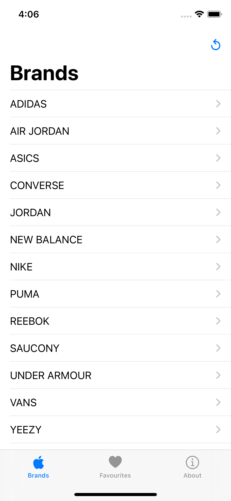
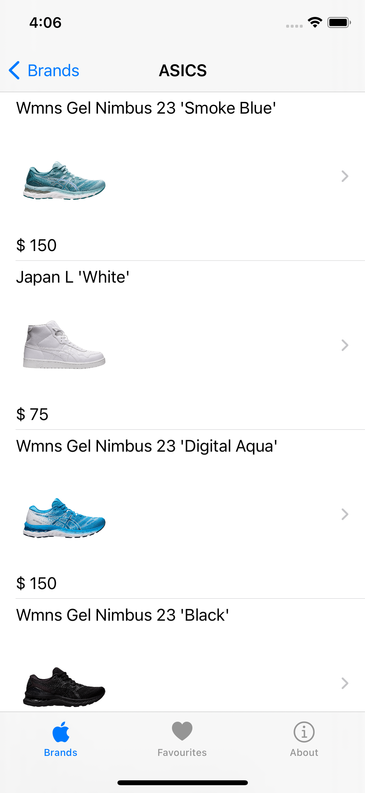
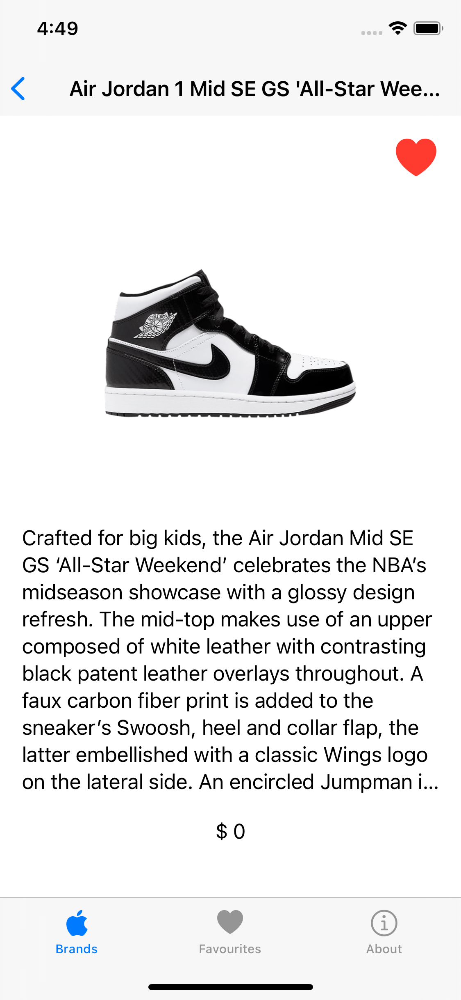

# AppSneaker

A simple Sneakers favourite list SwiftUI App to demo Combine + basic view building using MVVM architecture. 

All the data is retrieved from the following Sneakers API from TG4 Solutions (https://tg4.solutions/the-sneaker-database-test-endpoints-available/)

<table>
  <tr>
    <td>Brands</td>
    <td>Sneaker list</td>
    <td>Detail</td>
  </tr>
  <tr>
    <td></td>
    <td></td>
    <td></td>
  </tr>
 </table>

 ## TBD
 - [ ] Persistence in disk 
 - [ ] Enhance Codable parsing 
 - [ ] Open detail from favourite list item
 - [ ] Search / Filters 
