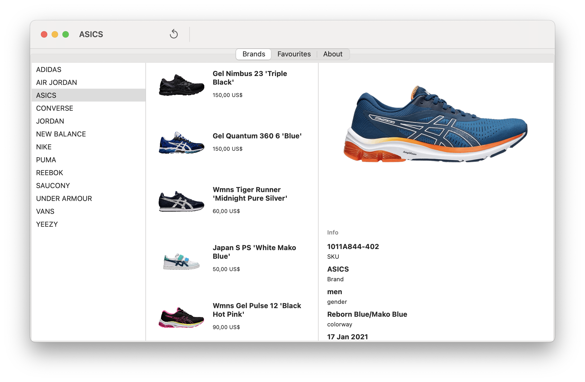

# AppSneaker

A simple Sneakers favourite list SwiftUI App to demo Combine + basic view building using MVVM architecture. 

All the data is retrieved from the following Sneakers API from TG4 Solutions (https://tg4.solutions/the-sneaker-database-test-endpoints-available/)

## iOS version
<table>
  <tr>
    <td>Brands</td>
    <td>Sneaker list</td>
    <td>Detail</td>
  </tr>
  <tr>
    <td></td>
    <td></td>
    <td></td>
  </tr>
 </table>

## macOS version
<table>
  <tr>
    <td>General view</td>
  </tr>
  <tr>
    <td></td>
  </tr>
 </table>

 ## TBD
 - [ ] Persistence in disk 
 - [X] macOS version
 - [X] Enhance Codable parsing 
 - [X] Display Shopping links in detail view
 - [X] Infinite scroll (pagination) 
 - [ ] Open detail from favourite list item (fetch by ID)
 - [ ] Search / Filters   
 - [ ] Manage my sneakers
